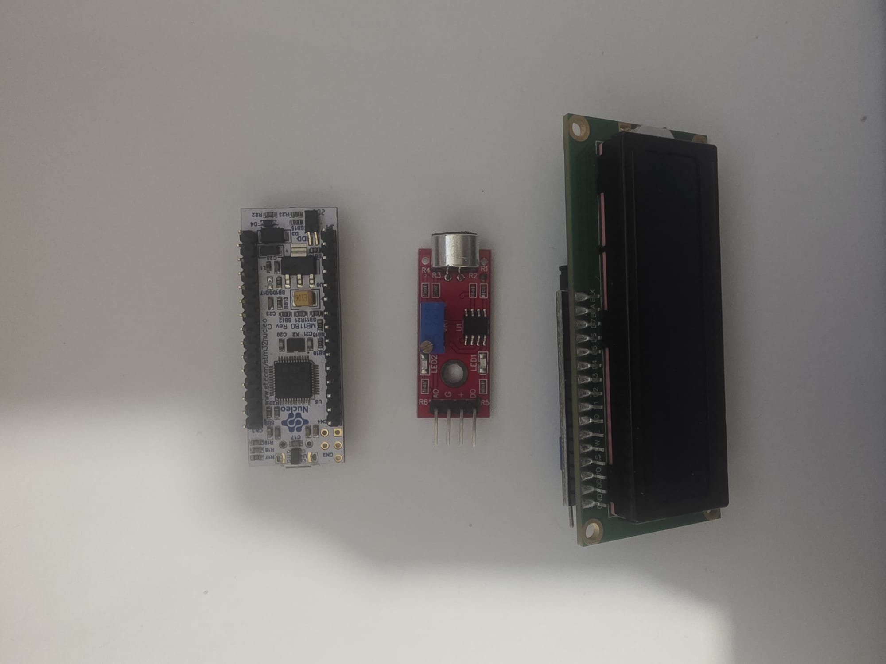
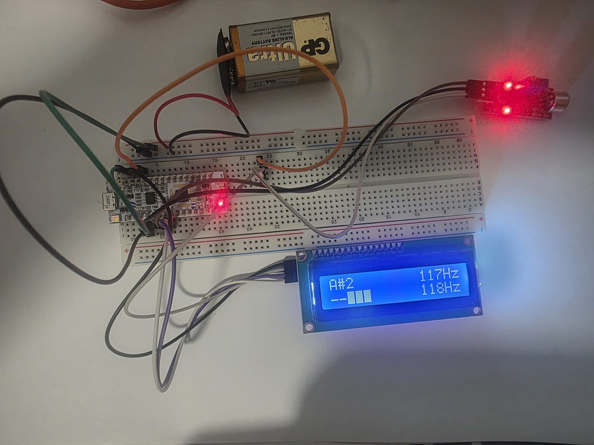
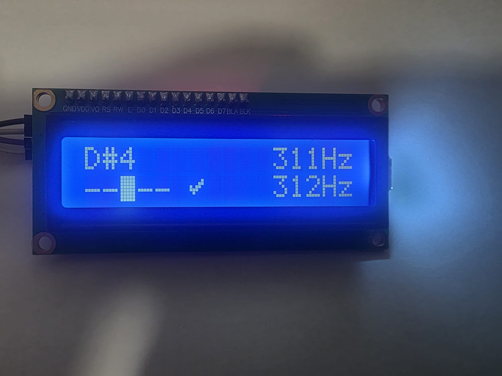

# STM32 Guitar Tuner

A bare-metal chromatic guitar tuner running on the STM32L432KC (NUCLEO-L432KC). Audio is sampled at 16 kHz via DMA-driven ADC, pitch is detected using the YIN algorithm, and results are displayed on a 16×2 HD44780 LCD with a 5-cell tuning meter.

All peripheral drivers are written at the register level against [RM0394](https://www.st.com/resource/en/reference_manual/rm0394-stm32l41xxx42xxx43xxx44xxx45xxx46xxx-advanced-armbased-32bit-mcus-stmicroelectronics.pdf) with no HAL abstractions beyond clock initialisation and UART scaffolding generated by STM32CubeIDE.

---

## Demo

| | |
|---|---|
|  |  |
| *Full circuit* | *LCD display — D#4, in tune* |


---

## Hardware

| Component | Part |
|---|---|
| Microcontroller | STM32L432KC on NUCLEO-L432KC |
| Microphone | LM393 sound sensor module |
| Display | 16×2 HD44780 LCD with PCF8574 I2C backpack |



### Wiring

| Signal | MCU pin | Notes |
|---|---|---|
| Mic AO (analog) | PB0 | ADC1 channel 15 |
| LCD SCL | PB6 | I2C1, AF4, open-drain |
| LCD SDA | PB7 | I2C1, AF4, open-drain |

> The LCD backpack requires a 5 V supply. Connect it to the NUCLEO's 5V pin and use dedicated GND pins for both the LCD and the MCU to avoid ground bounce corrupting the I2C bus.

---

## How it works

### Audio pipeline

```
LM393 AO ──► PB0 (ADC1 ch15)
                  │
             TIM6 @ 16 kHz (TRGO trigger)
                  │
             DMA1 Channel 1 (circular, 16-bit)
                  │
             adc_buf[2048]  ──► DMA TC interrupt ──► process_buffer()
```

TIM6 fires at 16 kHz and triggers the ADC via the TRGO line. DMA transfers each conversion result into a 2048-sample circular buffer. On each transfer-complete interrupt, `process_buffer()` runs YIN on the latest buffer.

### YIN pitch detection

[YIN](http://audition.ens.fr/adc/pdf/2002_JASA_YIN.pdf) (de Cheveigné & Kawahara, 2002) finds the fundamental period by searching for the first minimum in the cumulative mean normalised difference function (CMND) below a threshold.

Steps in `process_buffer()`:

1. **DC removal** — subtract the buffer mean from each sample.
2. **Difference function** — compute the squared difference sum for each lag τ.
3. **CMND** — normalise each d(τ) by the running mean up to τ.
4. **Threshold search** — find the first τ ≥ 6 where d(τ) < 0.10, then walk to the local minimum.
5. **Parabolic refinement** — fit a parabola to the three samples around the minimum for sub-sample accuracy.
6. **Frequency** — f = 16000 / τ_refined.

If no dip is found, the frame is treated as silence. The display clears after three consecutive silent frames (`RELEASE_FRAMES = 3`) to prevent flicker on single dropouts.

### Display layout

```
Row 0:  E2              82Hz
Row 1:  ▄ ▄ █ ▄ ▄   ✓     81Hz
        └─────────┘
        5-cell meter
```

- The centre cell of the meter is always lit.
- Flat: cells fill leftward. Sharp: cells fill rightward.
- ±5 cents → checkmark glyph; ±6–20 cents → 1 extra cell; >20 cents → 2 extra cells.
- Target frequency (equal temperament, A4 = 440 Hz) shown on row 0.
- Measured frequency shown on row 1.
- Per-cell diffing avoids full-screen redraws and the flicker they cause.

### Equal temperament

Target frequencies are computed exactly as:

```c
f(i) = 440.0f * exp2f((i - 41) / 12.0f)
```

where index 0 is E1 and index 41 is A4. Cents deviation uses `log2f`.

---

## Drivers

Three peripheral drivers were written from scratch:

### `i2c/` — I2C1 single-byte transmit

Blocking transmit with NACK detection and timeout recovery. Uses `AUTOEND` mode so the hardware issues START, data, and STOP in a single CR2 write.

Key register details (RM0394 §37):
- `TIMINGR = 0x10909CEC` — 100 kHz at 32 MHz PCLK1
- `ICR` is write-1-to-clear; never read-modify-write it
- Wait for `ADRDY` before asserting `ADSTART`

### `lcd/` — HD44780 via PCF8574

4-bit mode driver supporting character printing, cursor positioning, display clear, and custom CGRAM glyph loading. Two custom glyphs are used (slots 1 and 2; slot 0 is avoided because glyph code 0x00 terminates C strings).

PCF8574 bit mapping:

```
P7 P6 P5 P4 | P3        | P2 | P1 | P0
DB7..DB4     | backlight | EN | RW | RS
```

---

## Build and flash

The project was built with **STM32CubeIDE 1.x**. To reproduce:

1. Clone the repo.
2. Open STM32CubeIDE and import as an *Existing Project*.
3. Build with the default `Debug` configuration (no changes needed).
4. Flash via the built-in ST-Link (Run → Debug or Run → Run).

UART diagnostic output is available on the ST-Link virtual COM port at **115200 8N1**.

---

## Project structure

```
Core/
├── Inc/
│   └── main.h              # HAL-generated header (clock, pin definitions)
└── Src/
    ├── main.c              # Entry point, peripheral init, YIN, display logic
    ├── i2c/
    │   ├── i2c.h
    │   └── i2c.c
    ├── lcd/
    │   ├── lcd.h
    │   └── lcd.c
Drivers/                    # STM32 HAL (generated, not modified)
docs/
└── images/
```

---

## Known limitations

- **Single DMA buffer** — the 2048-sample buffer is read while DMA is still writing into it. A race condition is possible but has not caused observable issues at this sample rate and processing time. The correct fix is DMA double-buffering with half-transfer and transfer-complete interrupts.
- **~128 ms latency floor** — one full 2048-sample window must complete before each pitch estimate. Double-buffering with 50% overlap would halve this.
- **No amplitude gate** — silence is detected purely from YIN returning no valid dip. The LM393 analog output's amplitude is not reliable enough for variance-based gating.

---

## References

- de Cheveigné, A. & Kawahara, H. (2002). *YIN, a fundamental frequency estimator for speech and music.* JASA 111(4). [PDF](http://audition.ens.fr/adc/pdf/2002_JASA_YIN.pdf)
- ST Microelectronics. *RM0394 — STM32L41x/42x/43x/44x/45x/46x Reference Manual.*
- ST Microelectronics. *UM1956 — STM32 Nucleo-32 boards user manual.*
- HD44780 datasheet (Hitachi).
